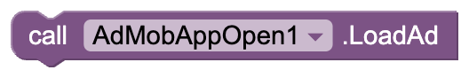
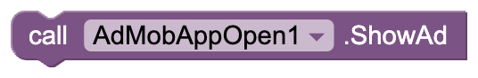
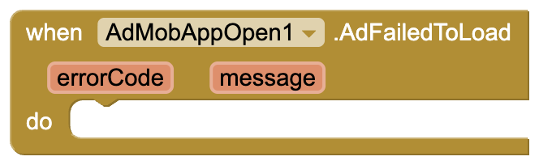
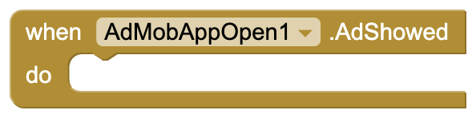
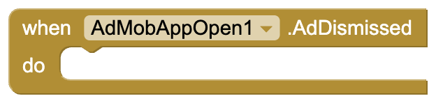
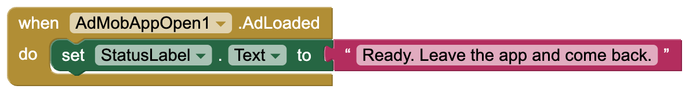
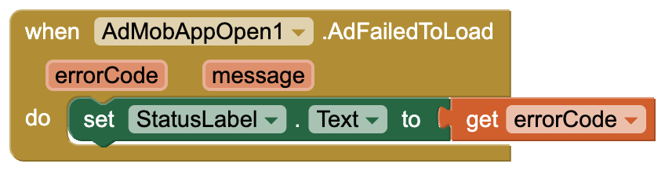
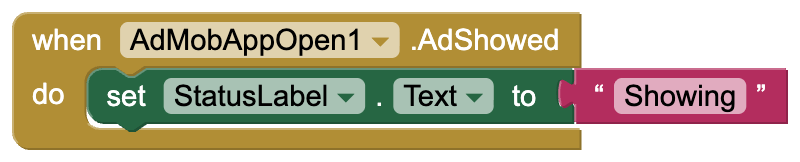
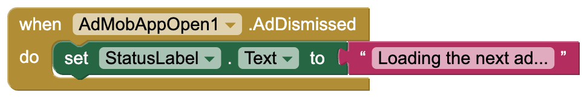
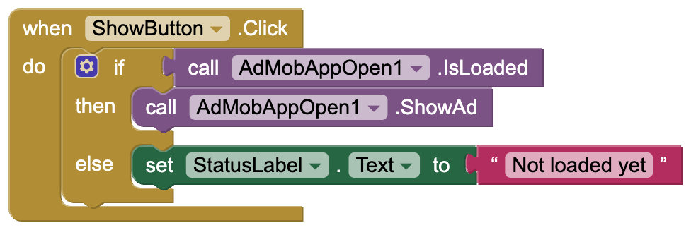

# AdMob App Open

A free extension that shows **AdMob app open ads** in MIT App Inventor apps: a
full-screen ad when the user comes back to your app. It does that **by itself**, which
App Inventor blocks can't detect on their own. Built on **Google Mobile Ads SDK 25.3.0**,
which Google supports until June 30, 2028.

- **No blocks needed:** with `ShowOnReturn` checked it loads an ad, shows it when the
  user returns to the app, and loads the next one.
- **AppId is a normal Designer property.** No manifest editing and no extra
  "manifest extension": paste your App ID and build.
- **Works out of the box:** the defaults are Google's test IDs.
- **Part of a set:** [Banner, Interstitial, Rewarded, App Open and Rewarded Interstitial](https://github.com/preetvadaliya/appinventor-extensions)
  are all free, and each works alone or together with the others.

| | |
|---|---|
| **Extension** | AdMobAppOpen |
| **Package** | `de.preet.admob.appopen` |
| **Version** | 1.0 |
| **Google Mobile Ads SDK** | 25.3.0 |
| **Minimum Android** | 6.0 (API 23) |
| **Size** | 11.9 MB |

## Download

- Extension: [de.preet.admob.appopen.aix](https://github.com/preetvadaliya/appinventor-extensions/raw/master/admob-app-open/de.preet.admob.appopen.aix)
- Sample project: [AdMobAppOpenDemo.aia](https://github.com/preetvadaliya/appinventor-extensions/raw/master/admob-app-open/AdMobAppOpenDemo.aia)

---

## Designer properties

| Name | Description | Default |
|---|---|---|
| **AppId** | Your AdMob app ID from the AdMob console, the one with a `~`. Use the same value in every AdMob extension in the app. | `ca-app-pub-3940256099942544~3347511713` (Google test app ID) |
| **AdUnitId** | This app open ad's unit ID, the one with a `/`. The test default always fills and can't affect your account. | `ca-app-pub-3940256099942544/9257395921` (Google test app open) |
| **ChildDirected** | Check this if the app is for children (Google Play Families policy). It also limits ads to content rated G. Unchecked leaves the setting unspecified. Applies to every AdMob ad in the app. | Unchecked |
| **ShowOnReturn** | Loads an ad when the screen starts, shows it whenever the user comes back to the app from the background, then loads the next one. Uncheck it to control everything with blocks. | Checked |

## Properties

| Name | Block | Description |
|---|---|---|
| **AppId** |   | Your AdMob app ID. Changing it after the first ad has loaded has no effect. |
| **AdUnitId** |   | This app open ad's unit ID. A change takes effect on the next load. |
| **ChildDirected** |   | Tags every ad request as directed at children and limits ads to content rated G. Setting it to false makes it unspecified again. |
| **ShowOnReturn** |   | Turns the automatic load-show-reload on or off. |
| **TestDeviceIds** |   | A **list** of test device IDs. These devices get test ads even with your real IDs. Applies to every AdMob ad in the app. |

## Functions

| Name | Block | Description |
|---|---|---|
| **LoadAd** |  | Loads an app open ad in the background. `AdLoaded` or `AdFailedToLoad` follows. Not needed with `ShowOnReturn` checked. |
| **ShowAd** |  | Shows the loaded ad now, for example at startup behind your own loading screen. With nothing loaded, `AdFailedToShow` fires with `Ad Not Ready`. |
| **IsLoaded** |  | Returns true when an ad is loaded and not expired. Google says an app open ad expires 4 hours after loading. |

## Events

| Name | Block | Description |
|---|---|---|
| **AdLoaded** |  | An app open ad loaded and is ready to show. |
| **AdFailedToLoad** |  | An app open ad could not load. `errorCode`: why, as text such as `No Fill` or `Network Error` `message`: Google's explanation |
| **AdShowed** |  | The ad now covers the screen. |
| **AdDismissed** |  | The user closed the ad. With `ShowOnReturn` checked, the next one is already loading. |
| **AdFailedToShow** |  | The ad could not be shown. `errorCode`: why, such as `Ad Not Ready` when nothing was loaded `message`: the explanation |

## Dropdown blocks

| Name | Block | Options |
|---|---|---|
| **AppOpenError** |  | `NoFill`, `NetworkError`, `InvalidRequest`, `AppIdMissing`, `InternalError`, `MediationNoFill`, `RequestIdMismatch`, `InvalidAdString`, `AdNotReady`, `AdReused`, `AppNotInForeground`, `MediationShowError`, `Unknown`. Compare it with `errorCode` in `AdFailedToLoad` or `AdFailedToShow`. |

---

## When does it show?

Only when the user **comes back to the app** from another app or the home screen. It
does not show when your app first opens, when you switch between your own screens, or
over another ad. Put the extension on **Screen1**, since it watches the whole app.

## Sample project

[AdMobAppOpenDemo.aia](https://github.com/preetvadaliya/appinventor-extensions/raw/master/admob-app-open/AdMobAppOpenDemo.aia) is ready to build. With `ShowOnReturn`
checked, the extension needs no blocks at all; these only show what is happening. Build
it, press the home button, then open the app again.

**Status of the ad.** The label shows when an ad is ready, what went wrong, when it is on
screen, and that the next one is loading after it closes.

**Show now** shows the loaded ad on demand, which is how you would use `ShowAd` yourself.

---

## Using it with the other AdMob extensions

All five AdMob extensions can be in the same app. They share one copy of Google's ads
SDK, so the app doesn't grow with each one. Set the same **AppId** on each, and set
**TestDeviceIds** and **ChildDirected** on any one of them: they apply to every AdMob ad
in the app.

## Going live with real ads

1. Set **AppId** (the one with `~`) and **AdUnitId** (the one with `/`) from your AdMob
   console in the Designer.
2. **Add your phone to TestDeviceIds first.** Tapping your own real ads can get your
   AdMob account suspended. The ID appears in logcat on the first ad request, in a line
   like `setTestDeviceIds(Arrays.asList("33BE2250B43518CCDA7DE426D04EE231"))`.
3. If you show one at startup with `ShowAd`, put a loading screen behind it, as Google
   recommends.
4. A new ad unit often returns `No Fill` for a few hours to a few days while Google
   reviews it. The test IDs always fill, so use them to tell a setup problem apart from
   a lack of ads.

## Things to know

- **Ads never show in the Companion.** It loads the extension's code but not the ads
  SDK, so build the APK to test.
- The project's minimum Android version becomes 6.0 (API 23).
- Use the same AppId in every AdMob extension in one app.

AdMob and its logo are trademarks of Google LLC. This extension is not affiliated with or
endorsed by Google.

Feedback and bug reports are welcome as a GitHub issue.

---

Made with ❤️ by Preet

