# AdMob Banner

A free extension that shows **AdMob banner ads** in MIT App Inventor apps, built on
**Google Mobile Ads SDK 25.3.0**, which Google supports until June 30, 2028.

- **AppId is a normal Designer property.** No manifest editing and no extra
  "manifest extension": paste your App ID and build.
- **Works out of the box:** the defaults are Google's test IDs, so you see a test ad
  on the first build.
- **Two blocks to show an ad:** `LoadAd` puts a banner inside an arrangement,
  `ShowAt` floats one at the top or bottom of the screen.
- **Part of a set:** [Banner, Interstitial, Rewarded, App Open and Rewarded Interstitial](https://github.com/preetvadaliya/appinventor-extensions)
  are all free, and each works alone or together with the others.

| | |
|---|---|
| **Extension** | AdMobBanner |
| **Package** | `de.preet.admob.banner` |
| **Version** | 1.1 |
| **Google Mobile Ads SDK** | 25.3.0 |
| **Minimum Android** | 6.0 (API 23) |
| **Size** | 11.9 MB |

## Download

- Extension: [de.preet.admob.banner.aix](https://github.com/preetvadaliya/appinventor-extensions/raw/master/admob-banner/de.preet.admob.banner.aix)
- Sample project: [AdMobBannerDemo.aia](https://github.com/preetvadaliya/appinventor-extensions/raw/master/admob-banner/AdMobBannerDemo.aia)

---

## Designer properties

| Name | Description | Default |
|---|---|---|
| **AppId** | Your AdMob app ID from the AdMob console, the one with a `~`. Use the same value in every AdMob extension in the app. | `ca-app-pub-3940256099942544~3347511713` (Google test app ID) |
| **AdUnitId** | This banner's ad unit ID, the one with a `/`. The test default always fills and can't affect your account. | `ca-app-pub-3940256099942544/6300978111` (Google test banner) |
| **ChildDirected** | Check this if the app is for children (Google Play Families policy). It also limits ads to content rated G. Unchecked leaves the setting unspecified. Applies to every AdMob ad in the app. | Unchecked |

## Properties

| Name | Block | Description |
|---|---|---|
| **AppId** |   | Your AdMob app ID. Changing it after the first ad has loaded has no effect, so set it in the Designer or before the first `LoadAd`. |
| **AdUnitId** |   | This banner's ad unit ID. A change takes effect on the next `LoadAd` or `ShowAt`. |
| **ChildDirected** |   | Tags every ad request as directed at children and limits ads to content rated G. Setting it to false makes it unspecified again. |
| **Visible** |   | Whether the banner is on screen. Hiding it keeps the loaded ad, so showing it again costs nothing. |
| **TestDeviceIds** |   | A **list** of test device IDs. These devices get test ads even with your real IDs. Applies to every AdMob ad in the app. |

## Functions

| Name | Block | Description |
|---|---|---|
| **LoadAd** | 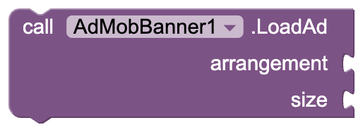 | Loads a banner into an arrangement on the screen. `arrangement`: a HorizontalArrangement or VerticalArrangement `size`: a `BannerSize` block (Adaptive is what Google recommends) `AdLoaded` or `AdFailedToLoad` follows. |
| **ShowAt** | 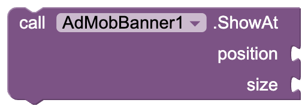 | Loads a banner that floats over your layout. `position`: a `BannerPosition` block (Top or Bottom) `size`: a `BannerSize` block `AdLoaded` or `AdFailedToLoad` follows. |
| **IsLoaded** |  | Returns true when a banner has loaded. |
| **DestroyAd** |  | Removes the banner and frees its memory. Call `LoadAd` or `ShowAt` to show a new one. |

## Events

| Name | Block | Description |
|---|---|---|
| **AdLoaded** |  | A banner loaded and is on screen. |
| **AdFailedToLoad** | 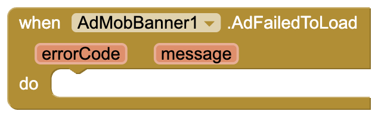 | A banner could not load. `errorCode`: why, as text such as `No Fill` or `Network Error` `message`: Google's explanation No Fill just means no ad was available, which is normal. |
| **AdClicked** |  | The user tapped the banner. |
| **AdImpression** | 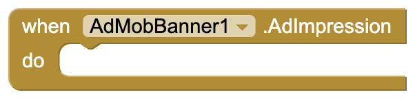 | The banner was counted as seen. |
| **AdOpened** | 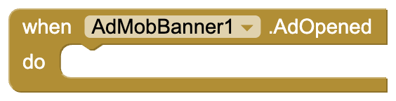 | A tapped ad opened over the app. Pause games or sound here. |
| **AdClosed** | 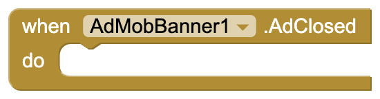 | The user came back from a tapped ad. |

## Dropdown blocks

| Name | Block | Options |
|---|---|---|
| **BannerSize** |  | `Adaptive` (fits the width, recommended), `Banner` 320×50, `LargeBanner` 320×100, `MediumRectangle` 300×250, `FullBanner` 468×60 (tablets), `Leaderboard` 728×90 (tablets) |
| **BannerPosition** |  | `Top`, `Bottom` |
| **BannerError** |  | `NoFill`, `NetworkError`, `InvalidRequest`, `AppIdMissing`, `InternalError`, `MediationNoFill`, `RequestIdMismatch`, `InvalidAdString`, `Unknown`. Compare it with `errorCode` in `AdFailedToLoad`. |

---

## Sample project

[AdMobBannerDemo.aia](https://github.com/preetvadaliya/appinventor-extensions/raw/master/admob-banner/AdMobBannerDemo.aia) is ready to build. Screen1 has a status
label, a detail label, a HorizontalArrangement called **BannerBox** (width: fill parent)
where the banner goes, four buttons, and **AdMobBanner1** with the default test IDs.

**Load a banner when the app starts.** `LoadAd` places it inside BannerBox with the
Adaptive size, which fits the width of the screen.

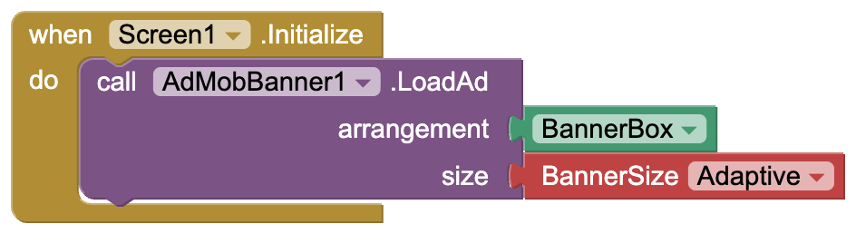

**Show what happened.** `AdLoaded` confirms the ad is on screen. `AdFailedToLoad` shows
the error code and Google's message, and `AdImpression` shows when the ad was counted.

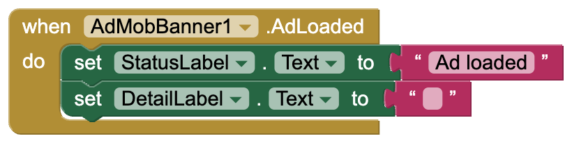

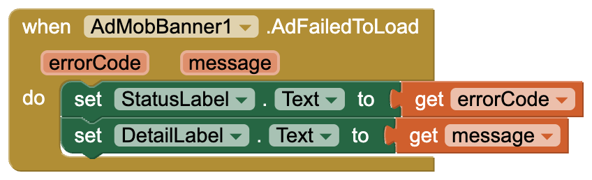

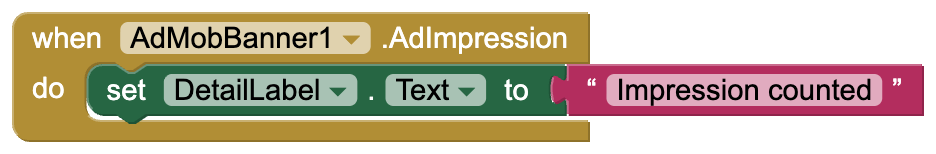

**Load in the box** loads a fresh banner into BannerBox again.

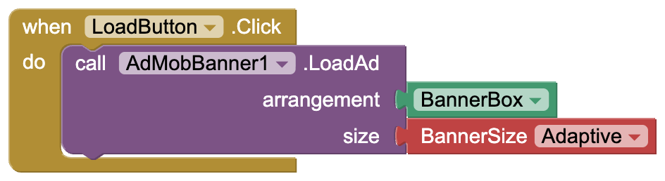

**Float at the bottom** loads a standard 320×50 banner that floats at the bottom of
the screen, over the layout.

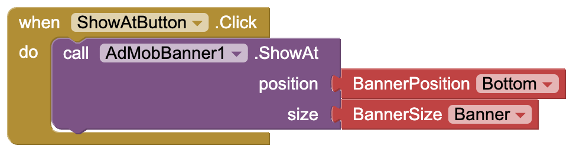

**Hide / show** flips `Visible`. The loaded ad is kept, so it comes back instantly.

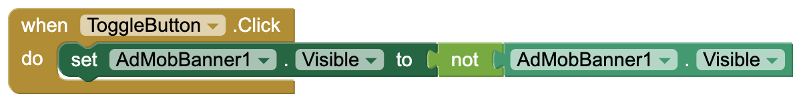

**Destroy** removes the banner and frees its memory.

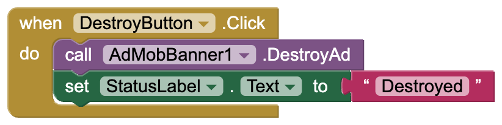

---

## Going live with real ads

1. Set **AppId** (the one with `~`) and **AdUnitId** (the one with `/`) from your AdMob
   console in the Designer.
2. **Add your phone to TestDeviceIds first.** Tapping your own real ads can get your
   AdMob account suspended. The ID appears in logcat on the first ad request, in a line
   like `setTestDeviceIds(Arrays.asList("33BE2250B43518CCDA7DE426D04EE231"))`.
3. A new ad unit often returns `No Fill` for a few hours to a few days while Google
   reviews it. The test IDs always fill, so use them to tell a setup problem apart from
   a lack of ads.

## Things to know

- **Ads never show in the Companion.** It loads the extension's code but not the ads
  SDK, so build the APK to test.
- The project's minimum Android version becomes 6.0 (API 23).
- Use the same AppId in every AdMob extension in one app.

AdMob and its logo are trademarks of Google LLC. This extension is not affiliated with or
endorsed by Google.

Feedback and bug reports are welcome as a GitHub issue.

---

Made with ❤️ by Preet

