# AdMob Interstitial

A free extension that shows **full-screen AdMob interstitial ads** in MIT App Inventor
apps, built on **Google Mobile Ads SDK 25.3.0**, which Google supports until June 30, 2028.

- **AppId is a normal Designer property.** No manifest editing and no extra
  "manifest extension": paste your App ID and build.
- **Works out of the box:** the defaults are Google's test IDs, so you see a test ad
  on the first build.
- **Three blocks:** `LoadAd` loads an ad in the background, `ShowAd` shows it at a
  break in your app, and `IsLoaded` tells you when it is ready.
- **Part of a set:** [Banner, Interstitial, Rewarded, App Open and Rewarded Interstitial](https://github.com/preetvadaliya/appinventor-extensions)
  are all free, and each works alone or together with the others.

| | |
|---|---|
| **Extension** | AdMobInterstitial |
| **Package** | `de.preet.admob.interstitial` |
| **Version** | 1.1 |
| **Google Mobile Ads SDK** | 25.3.0 |
| **Minimum Android** | 6.0 (API 23) |
| **Size** | 11.8 MB |

## Download

- Extension: [de.preet.admob.interstitial.aix](https://github.com/preetvadaliya/appinventor-extensions/raw/master/admob-interstitial/de.preet.admob.interstitial.aix)
- Sample project: [AdMobInterstitialDemo.aia](https://github.com/preetvadaliya/appinventor-extensions/raw/master/admob-interstitial/AdMobInterstitialDemo.aia)

---

## Designer properties

| Name | Description | Default |
|---|---|---|
| **AppId** | Your AdMob app ID from the AdMob console, the one with a `~`. Use the same value in every AdMob extension in the app. | `ca-app-pub-3940256099942544~3347511713` (Google test app ID) |
| **AdUnitId** | This interstitial's ad unit ID, the one with a `/`. The test default always fills and can't affect your account. | `ca-app-pub-3940256099942544/1033173712` (Google test interstitial) |
| **ChildDirected** | Check this if the app is for children (Google Play Families policy). It also limits ads to content rated G. Unchecked leaves the setting unspecified. Applies to every AdMob ad in the app. | Unchecked |

## Properties

| Name | Block | Description |
|---|---|---|
| **AppId** |   | Your AdMob app ID. Changing it after the first ad has loaded has no effect, so set it in the Designer or before the first `LoadAd`. |
| **AdUnitId** |   | This interstitial's ad unit ID. A change takes effect on the next `LoadAd`. |
| **ChildDirected** |   | Tags every ad request as directed at children and limits ads to content rated G. Setting it to false makes it unspecified again. |
| **TestDeviceIds** |   | A **list** of test device IDs. These devices get test ads even with your real IDs. Applies to every AdMob ad in the app. |

## Functions

| Name | Block | Description |
|---|---|---|
| **LoadAd** |  | Loads an interstitial in the background. `AdLoaded` or `AdFailedToLoad` follows. Ignored while a load is already running. |
| **ShowAd** |  | Shows the loaded interstitial full screen. One loaded ad shows only once, so call `LoadAd` again in `AdDismissed`. With nothing loaded, `AdFailedToShow` fires with `Ad Not Ready`. |
| **IsLoaded** |  | Returns true when an interstitial is loaded and ready to show. |

## Events

| Name | Block | Description |
|---|---|---|
| **AdLoaded** | 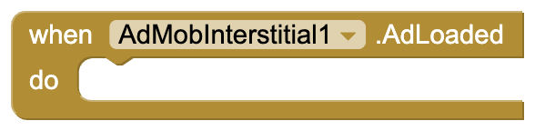 | An interstitial loaded and is ready to show. |
| **AdFailedToLoad** | 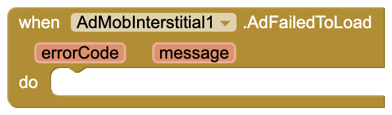 | An interstitial could not load. `errorCode`: why, as text such as `No Fill` or `Network Error` `message`: Google's explanation No Fill just means no ad was available, which is normal. |
| **AdShowed** | 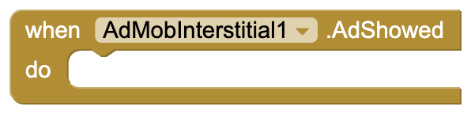 | The ad now covers the screen. Pause games or sound here. |
| **AdDismissed** | 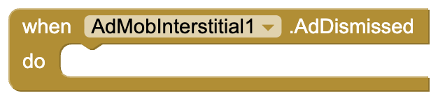 | The user closed the ad. Resume your app and call `LoadAd` for the next one. |
| **AdFailedToShow** |  | The ad could not be shown. `errorCode`: why, such as `Ad Not Ready` when nothing was loaded `message`: the explanation |

## Dropdown blocks

| Name | Block | Options |
|---|---|---|
| **InterstitialError** |  | `NoFill`, `NetworkError`, `InvalidRequest`, `AppIdMissing`, `InternalError`, `MediationNoFill`, `RequestIdMismatch`, `InvalidAdString`, `AdNotReady`, `AdReused`, `AppNotInForeground`, `MediationShowError`, `Unknown`. Compare it with `errorCode` in `AdFailedToLoad` or `AdFailedToShow`. |

---

## Sample project

[AdMobInterstitialDemo.aia](https://github.com/preetvadaliya/appinventor-extensions/raw/master/admob-interstitial/AdMobInterstitialDemo.aia) is ready to build. Screen1
has a status label, a **Load ad** and a **Show ad** button, and **AdMobInterstitial1**
with the default test IDs.

**Load an ad as soon as the app starts,** so one is ready when you need it.

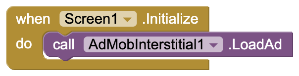

**Show whether it loaded.** `AdLoaded` says the ad is ready, `AdFailedToLoad` shows why
it isn't.

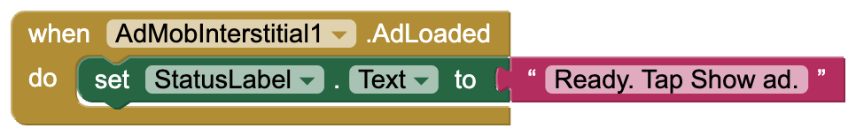

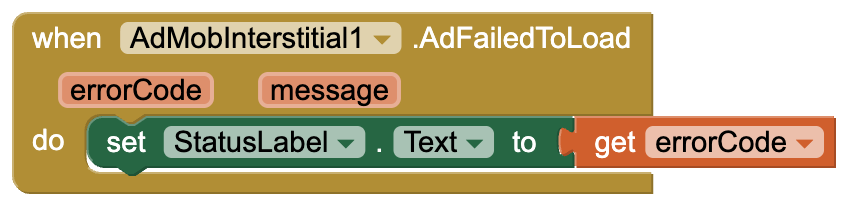

**Load ad** requests one by hand.

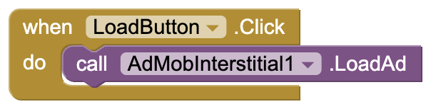

**Show ad** checks `IsLoaded` first, so tapping it too early just shows a message.

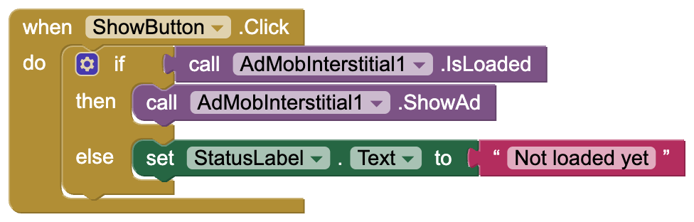

**While the ad is up and after it closes.** `AdShowed` is where a game would pause.
`AdDismissed` loads the next ad right away, because each loaded ad shows only once.

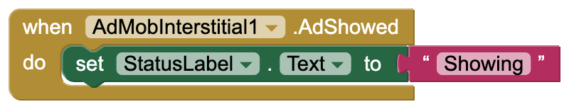

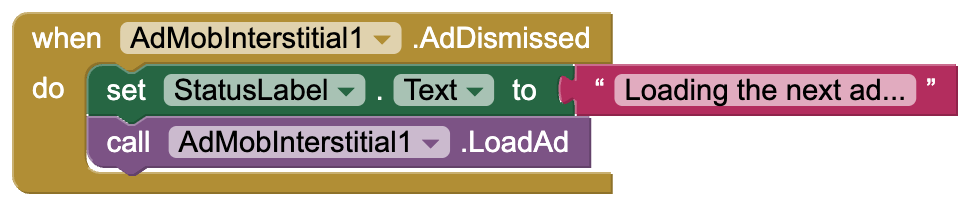

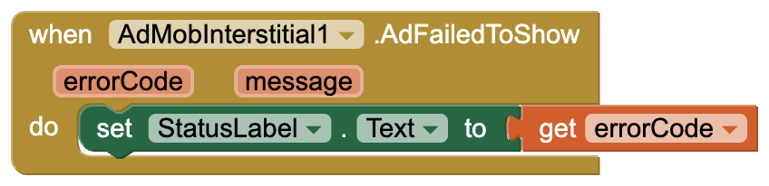

---

## Using it with the other AdMob extensions

All five AdMob extensions can be in the same app. They share one copy of Google's ads
SDK, so the app doesn't grow with each one. Set the same **AppId** on each, and set
**TestDeviceIds** and **ChildDirected** on any one of them: they apply to every AdMob ad
in the app.

## Going live with real ads

1. Set **AppId** (the one with `~`) and **AdUnitId** (the one with `/`) from your AdMob
   console in the Designer.
2. **Add your phone to TestDeviceIds first.** Tapping your own real ads can get your
   AdMob account suspended. The ID appears in logcat on the first ad request, in a line
   like `setTestDeviceIds(Arrays.asList("33BE2250B43518CCDA7DE426D04EE231"))`.
3. **Show interstitials at natural breaks,** such as between levels or after a task is
   finished. Google's policy doesn't allow interstitials that appear while the app is
   opening or closing, or after every tap.
4. A new ad unit often returns `No Fill` for a few hours to a few days while Google
   reviews it. The test IDs always fill, so use them to tell a setup problem apart from
   a lack of ads.

## Things to know

- **Ads never show in the Companion.** It loads the extension's code but not the ads
  SDK, so build the APK to test.
- The project's minimum Android version becomes 6.0 (API 23).
- Use the same AppId in every AdMob extension in one app.

AdMob and its logo are trademarks of Google LLC. This extension is not affiliated with or
endorsed by Google.

Feedback and bug reports are welcome as a GitHub issue.

---

Made with ❤️ by Preet

