# AdMob Rewarded

A free extension that shows **AdMob rewarded ads** in MIT App Inventor apps: full-screen
videos the user chooses to watch in exchange for something in your app, like coins, a
hint or an extra life. Built on **Google Mobile Ads SDK 25.3.0**, which Google supports
until June 30, 2028.

- **AppId is a normal Designer property.** No manifest editing and no extra
  "manifest extension": paste your App ID and build.
- **Works out of the box:** the defaults are Google's test IDs, so you see a test ad
  on the first build.
- **Simple:** `LoadAd`, then `ShowAd` when the user asks for the reward, and give the
  reward in `UserEarnedReward`.
- **Part of a set:** [Banner, Interstitial, Rewarded, App Open and Rewarded Interstitial](https://github.com/preetvadaliya/appinventor-extensions)
  are all free, and each works alone or together with the others.

| | |
|---|---|
| **Extension** | AdMobRewarded |
| **Package** | `de.preet.admob.rewarded` |
| **Version** | 1.0 |
| **Google Mobile Ads SDK** | 25.3.0 |
| **Minimum Android** | 6.0 (API 23) |
| **Size** | 11.8 MB |

## Download

- Extension: [de.preet.admob.rewarded.aix](https://github.com/preetvadaliya/appinventor-extensions/raw/master/admob-rewarded/de.preet.admob.rewarded.aix)
- Sample project: [AdMobRewardedDemo.aia](https://github.com/preetvadaliya/appinventor-extensions/raw/master/admob-rewarded/AdMobRewardedDemo.aia)

---

## Designer properties

| Name | Description | Default |
|---|---|---|
| **AppId** | Your AdMob app ID from the AdMob console, the one with a `~`. Use the same value in every AdMob extension in the app. | `ca-app-pub-3940256099942544~3347511713` (Google test app ID) |
| **AdUnitId** | This rewarded ad's unit ID, the one with a `/`. The test default always fills and can't affect your account. | `ca-app-pub-3940256099942544/5224354917` (Google test rewarded) |
| **ChildDirected** | Check this if the app is for children (Google Play Families policy). It also limits ads to content rated G. Unchecked leaves the setting unspecified. Applies to every AdMob ad in the app. | Unchecked |

## Properties

| Name | Block | Description |
|---|---|---|
| **AppId** | 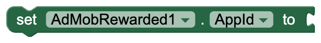 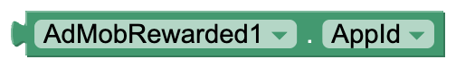 | Your AdMob app ID. Changing it after the first ad has loaded has no effect, so set it in the Designer or before the first `LoadAd`. |
| **AdUnitId** | 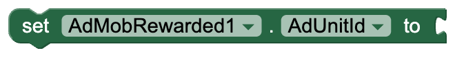 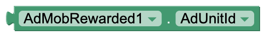 | This rewarded ad's unit ID. A change takes effect on the next `LoadAd`. |
| **ChildDirected** | 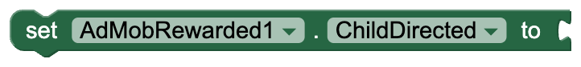 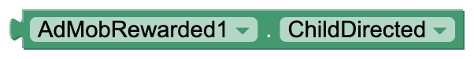 | Tags every ad request as directed at children and limits ads to content rated G. Setting it to false makes it unspecified again. |
| **TestDeviceIds** | 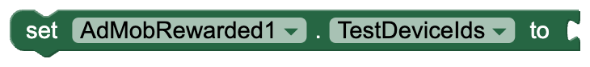 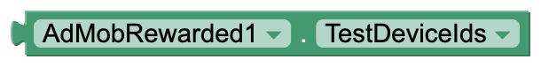 | A **list** of test device IDs. These devices get test ads even with your real IDs. Applies to every AdMob ad in the app. |

## Functions

| Name | Block | Description |
|---|---|---|
| **LoadAd** | 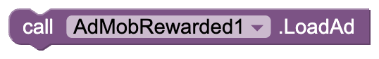 | Loads a rewarded ad in the background. `AdLoaded` or `AdFailedToLoad` follows. Ignored while a load is already running. |
| **ShowAd** | 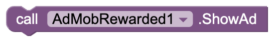 | Shows the loaded rewarded ad full screen. Give the reward in `UserEarnedReward`. One loaded ad shows only once, so call `LoadAd` again in `AdDismissed`. With nothing loaded, `AdFailedToShow` fires with `Ad Not Ready`. |
| **IsLoaded** |  | Returns true when a rewarded ad is loaded and ready to show. |

## Events

| Name | Block | Description |
|---|---|---|
| **AdLoaded** | 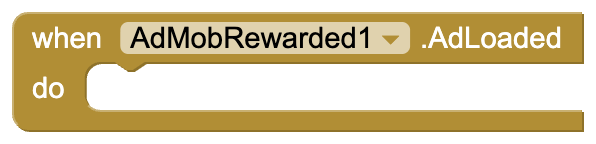 | A rewarded ad loaded and is ready to show. |
| **AdFailedToLoad** |  | A rewarded ad could not load. `errorCode`: why, as text such as `No Fill` or `Network Error` `message`: Google's explanation No Fill just means no ad was available, which is normal. |
| **AdShowed** | 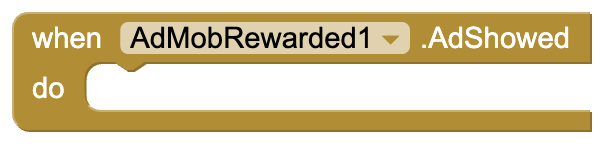 | The ad now covers the screen. Pause games or sound here. |
| **UserEarnedReward** | 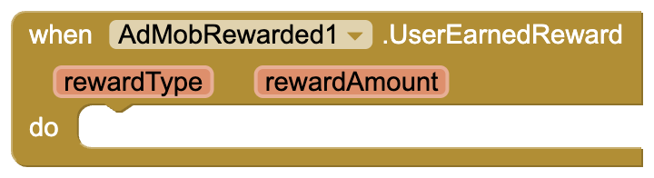 | The user watched enough of the ad to earn the reward. **Give the reward here and only here**: someone who closes the ad early still gets `AdDismissed`. `rewardType`: the reward's name, such as `coins` `rewardAmount`: how many Both come from the ad unit's settings in the AdMob console. |
| **AdDismissed** | 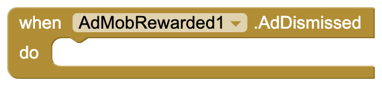 | The user closed the ad. Resume your app and call `LoadAd` for the next one. |
| **AdFailedToShow** | 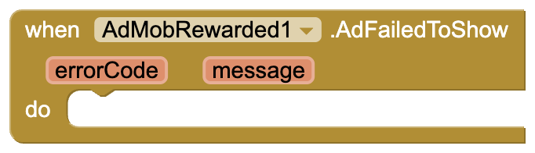 | The ad could not be shown. `errorCode`: why, such as `Ad Not Ready` when nothing was loaded `message`: the explanation |

## Dropdown blocks

| Name | Block | Options |
|---|---|---|
| **RewardedError** |  | `NoFill`, `NetworkError`, `InvalidRequest`, `AppIdMissing`, `InternalError`, `MediationNoFill`, `RequestIdMismatch`, `InvalidAdString`, `AdNotReady`, `AdReused`, `AppNotInForeground`, `MediationShowError`, `Unknown`. Compare it with `errorCode` in `AdFailedToLoad` or `AdFailedToShow`. |

---

## Sample project

[AdMobRewardedDemo.aia](https://github.com/preetvadaliya/appinventor-extensions/raw/master/admob-rewarded/AdMobRewardedDemo.aia) is ready to build. Screen1 has a
status label, a coin counter, a **Watch ad for coins** button, and **AdMobRewarded1** with
the default test IDs.

**Load an ad as soon as the app starts,** so one is ready when the user asks for it.

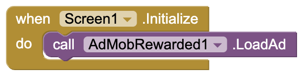

**Show whether it loaded.** `AdLoaded` says the ad is ready, `AdFailedToLoad` shows why
it isn't.

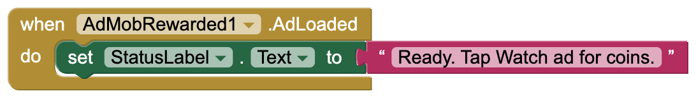

**Watch ad for coins** checks `IsLoaded` first, so tapping it too early just shows a
message.

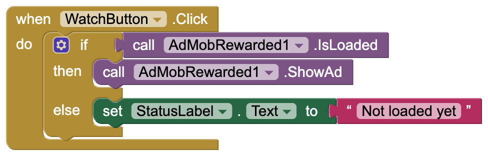

**Give the reward.** `UserEarnedReward` adds `rewardAmount` to the coin counter. It fires
only when the user has watched enough of the ad.

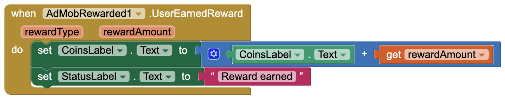

**After the ad closes,** `AdDismissed` loads the next one right away, because each loaded
ad shows only once. `AdFailedToShow` shows what went wrong.

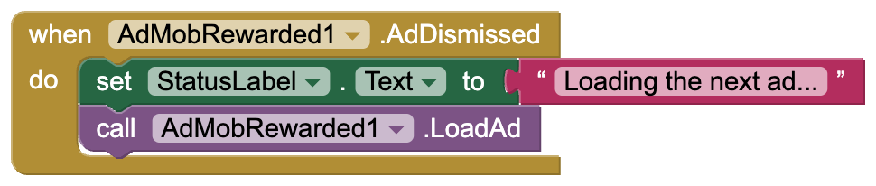

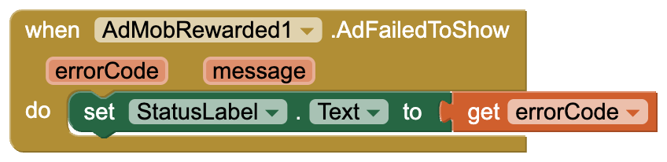

---

## Using it with the other AdMob extensions

All five AdMob extensions can be in the same app. They share one copy of Google's ads
SDK, so the app doesn't grow with each one. Set the same **AppId** on each, and set
**TestDeviceIds** and **ChildDirected** on any one of them: they apply to every AdMob ad
in the app.

## Going live with real ads

1. Set **AppId** (the one with `~`) and **AdUnitId** (the one with `/`) from your AdMob
   console in the Designer. The reward's name and amount are set on that ad unit in the
   console.
2. **Add your phone to TestDeviceIds first.** Tapping your own real ads can get your
   AdMob account suspended. The ID appears in logcat on the first ad request, in a line
   like `setTestDeviceIds(Arrays.asList("33BE2250B43518CCDA7DE426D04EE231"))`.
3. **Let the user choose.** Show a rewarded ad only when the user taps something like
   "Watch an ad for 10 coins", and say what they'll get before it starts.
4. A new ad unit often returns `No Fill` for a few hours to a few days while Google
   reviews it. The test IDs always fill, so use them to tell a setup problem apart from
   a lack of ads.

## Things to know

- **Ads never show in the Companion.** It loads the extension's code but not the ads
  SDK, so build the APK to test.
- The project's minimum Android version becomes 6.0 (API 23).
- Use the same AppId in every AdMob extension in one app.

AdMob and its logo are trademarks of Google LLC. This extension is not affiliated with or
endorsed by Google.

Feedback and bug reports are welcome as a GitHub issue.

---

Made with ❤️ by Preet

